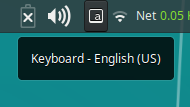
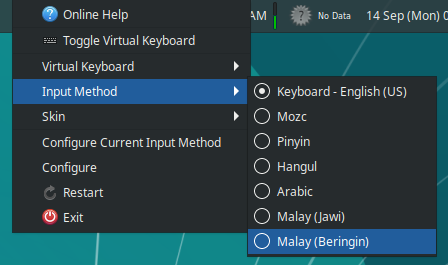

# Beringin Fcitx Table / *Jadual Fcitx Beringin* / جادوال Fcitx بريڠين

Basic table file of fcitx to write Beringin on Linux.

*Fail jadual asas fcitx untuk menulis Beringin di Linux.*

فايل جادوال اساس fcitx اونتوق منوليس بريڠين دLinux.

## Fcitx?

Fcitx (read phy.teeks) is an input method framework that currently supports Linux and Unix systems. It allows people to write in many languages with its three major engine system namely Pinyin-, QuWei- and Table-based input methods. It also includes support for existing Linux keyboards so you can use them directly without needing to switch to different input method.

*Fcitx (baca sebagai fai.tiks) ialah rangka kerja kaedah input yang menyokong sistem Linux dan Unix pada ketika ini. Ia membolehkan orang ramai untuk menulis dalam pelbagai bahasa dengan tiga sistem enjin utamanya iaitu kaedah input berasaskan Pinyin, QuWei dan Jadual. Ia juga sertakan sokongan papan kekunci Linux sedia ada jadi anda boleh gunakannya secara terus tanpa perlu menukar ke kaedah input berlainan.*

Fcitx (باچ سباݢاي فاي.تيکس) اياله راڠک کرجا قاعده اينڤوت يڠ مڽوکوڠ سيستم Linux (لي.نکس) دان Unix (يونيکس) ڤد کتيک اين. اي ممبوليهکن اورڠ راماي اونتوق منوليس دالم ڤلباݢاي بهاس دڠن تيݢ سيستم اينجين اوتامڽ ايايت قاعده اينڤوت براساسکن ڤينيين⹁ چيوي دان جادوال. اي جوݢ سرتکن سوکوڠن ڤاڤن ککونچي Linux سديا اد جادي اندا بوليه ݢوناکنڽ سچارا تروس تنڤ ڤرلو منوکر کقاعده اينڤوت يڠ برلاٴينن.

Fcitx --> https://fcitx-im.org

##  Install / *Pasang* / ڤاسڠ

English
1. Download the [latest release zip file](https://github.com/beringin-mnh48/fcitx-table-beringin/releases/latest/download/beringin.zip).
2. Extract the files `beringin.conf` and `beringin.mb` from the zip.
3. Put those files into this directory at your home directory: `~/.config/fcitx/table/`.
4. Reload your fcitx instance (exact steps depend on your system).
5. Choose `Malay (Beringin)` from `Input Method` in fcitx menu (or use the keyboard shortcut to change input method).
6. Start writing Malay in Beringin.

Bahasa Melayu (Rumi)
1. Muat turun [fail zip terbitan terbaharu](https://github.com/beringin-mnh48/fcitx-table-beringin/releases/latest/download/beringin.zip).
2. Sarikan fail `beringin.conf` dan `beringin.mb` daripada fail zip tersebut.
3. Letakkan fail tersebut ke dalam direktori ini yang berada di direktori rerumah anda: `~/.config/fcitx/table/`.
4. Muat semula tika fcitx anda (langkah sebenar bergantung kepada sistem anda).
5. Pilih `Malay (Beringin)` daripada menu `Input Method` dalam fcitx (atau gunakan pintasan papan kekunci untuk mengubah kaedah input).
6. Mula menulis dalam tulisan Beringin.

بهاس ملاي (جاوي)

<ol>
<li>موات تورون <a href="https://github.com/beringin-mnh48/fcitx-table-beringin/releases/latest/download/beringin.zip">فايل زيڤ تربيتن تربهارو</a>.</li>
<li>ساريکن فايل <code>beringin.conf</code> دان <code>beringin.mb</code> درڤد فايل زيڤ ترسبوت.</li>
<li>لتقکب فايل ترسبوت کدالم ديريکتوري اين يڠ براد دديريکتوري ررومه ابدا: <code>~/.config/fcitx/table/</code>.</li>
<li>موات سمولا تيک fcitx اندا (لڠکه سبنر برݢنتوڠ کڤد سيستم اندا).</li>
<li>ڤيليه <code>Malay (Beringin)</code> درڤد مينو <code>Input Method</code> دالم fcitx (اتاو ݢوناکن ڤينتسن ڤاڤن ککونچي اونتوق مڠوبه قاعده اينڤوت).</li>
<li>مولا منوليس دالم توليسن بريڠين.</li>
</ol>

## Not in list? / *Tiada dalam senarai?* / تيادا دالم سناراي؟

On some system, it may not appear automatically even after reloading fcitx instance. Follow these steps to make it appear manually.
1. Open fcitx input method configuration menu (exact steps depend on your system).
2. From the `Input Method` tab, click on the plus button `+` at bottom-left corner to bring up `Add input method` dialog.
3. Uncheck the option `Only Show Current Language`.
4. Search for `beringin` in the search box, or scroll through the list and look for `Malay (Beringin)` (searching for `Malay` would not work because it actually search based on internal name).
5. Click on `Malay (Beringin)` and click `OK`.
6. Close the configuration window.
7. You should now see `Malay (Beringin)` under `Input Method` in fcitx menu.

*Pada sesetengah sistem, ia mungkin tidak muncul secara automatik walaupun setelah memuat semula tika. Ikuti langkah ini untuk membuatkannya muncul secara manual.*
1. Buka menu konfigurasi kaedah input fcitx (langkah sebenar bergantung kepada sistem anda).
2. Daripada tab `Input Method`, klik pada butang campur `+` di hujung bawah-kiri untuk membuka dialog `Add input method`.
3. Buang tanda pada pilihan `Only Show Current Language`.
4. Tuliskan `beringin` di kotak carian, atau tatal senarai dan cari sendiri `Malay (Beringin)` (Kalau tulis `Malay` tidak akan jumpa kerana ia cari berdasarkan nama dalaman).
5. Klik pada `Malay (Beringin)` dan klik `OK`.
6. Tutup tetingkap konfigurasi.
7. Kini anda patut nampak `Malay (Beringin)` bawah menu `Input Method` di fcitx.

ڤد سستڠه سيستم⹁ اي موڠکين تيدق مونچول سچارا اٴوتوماتيک والاوڤون ستله مموات سمولا تيک. ايکوتي لڠکه اين اونتوق ممبواتکنڽ مونچول سچارا مانوال.

<ol>
<li>بوک مينو کونفيݢوراسي قاعده اينڤوت fcitx (لڠکه سبنر برݢنتوڠ کڤد سيستم اندا).</li>
<li>درڤد تب <code>Input Method</code>⹁ کليک ڤد بوتڠ چمڤور <code>+</code> دهوجوڠ باوه-کيري اونتوق ممبوک ديالوݢ <code>Add input method</code>.</li>
<li>بواڠ تندا ڤد ڤيليهن <code>Only Show Current Language</code>.</li>
<li>توليسکن <code>beringin</code> دکوتق چاريان⹁ اتاو تاتل سناراي دان چاري سنديري <code>Malay (Beringin)</code> (کالاو توليس <code>Malay</code> تيدق اکن جومڤ کران اي چاري برداسرکن نام دالمن).</li>
<li>کليک ڤد <code>Malay (Beringin)</code> دان کليک <code>OK</code>.</li>
<li>توتوڤ تتيڠکڤ کونفيݢوراسي.</li>
<li>کيني اندا ڤاتوت نمڤق <code>Malay (Beringin)</code> باوه مينو <code>Input Method</code> دfcitx.</li>
</ol>

## Other problems? / *Masalah lain?* / مسئله لاٴين؟

Please see if your problem is part of any [issue](https://github.com/beringin-mnh48/fcitx-table-beringin/issues) in the repository. If none exist for your problem, create a new issue.

*Sila periksa sama ada masalah anda itu sebahagian daripada mana-mana [isu](https://github.com/beringin-mnh48/fcitx-table-beringin/issues) sedia ada dalam repositori ataupun tidak. Jika tiada, cipta isu baharu.*

سيلا ڤريقسا سام اد مسئله اندا ايت سبهاݢين درڤد مان٢ <a href="https://github.com/beringin-mnh48/fcitx-table-beringin/issues">ايسو</a> سديا اد دالم ريڤوسيتوري اتاوڤون تيدق. جيک تيادا⹁ چيڤت ايسو بهارو.

## License / *Lesen* / ليسين

Since the files are based off [`fcitx-table-other`](https://github.com/fcitx/fcitx-table-other) which are licensed under GPLv3+, the package here would also forced to be licensed under the same license. So, these are GPLv3+. However, do note that the source table file `src/beringin.txt` is actually licensed under LGPL-2.1+ because the file that I use as source, `tables/other/compose.txt` in `fcitx-table-other` had a header attached saying it is licensed under LGPL-2.1+.

*Memandangkan fail di sini dicipta berdasarkan [`fcitx-table-other`](https://github.com/fcitx/fcitx-table-other) yang dilesenkan bawah GPLv3+, maka pakej di sini juga terpaksa dilesenkan bawah lesen yang sama. Oleh itu, fail di sini dilesenkan bawah GPLv3+. Namun begitu, fail jadual sumber `src/beringin.txt` sebenarnya dilesenkan bawah LGPL-2.1+ kerana fail yang saya guna sebagai sumber, `tables/other/compose.txt` di `fcitx-table-other` mempunyai pengepala yang menyatakan ianya dilesenkan bawah LGPL-2.1+.*

ممندڠکن فايل دسين دچيڤت برداسرکن <a href="https://github.com/fcitx/fcitx-table-other"><code>fcitx-table-other</code></a> يڠ دليسينکن باوه GPLv3+⹁ ماک ڤاکيج دسين جوݢ ترڤقسا دليسينکن باوه ليسين يڠ سام. اوليه ايت⹁ فايل دسين دليسينکن باوه GPLv3+. نامون بݢيت⹁ فايل جادوال سومبر <code>src/beringin.txt</code> سبنرڽ دليسينکن باوه LGPL-2.1+ کران فايل يڠ ساي ݢونا سباݢاي سومبر⹁ <code>tables/other/compose.txt</code> د<code>fcitx-table-other</code> ممڤوڽاٴي ڤڠڤال يڠ مڽاتکن اياڽ دليسينکن باوه LGPL-2.1+.

